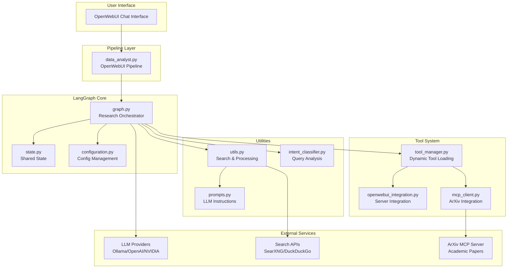
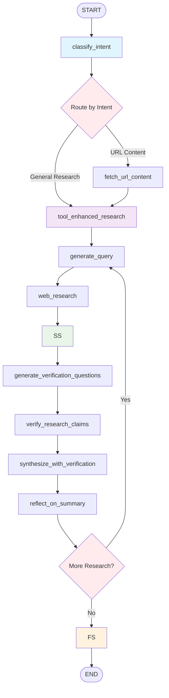

# Deep Researcher Pipeline Documentation

A comprehensive research automation pipeline built with LangGraph and OpenWebUI integration.

## Table of Contents

- [🏗️ Architecture Overview](#️-architecture-overview)
- [🔧 Core Components](#-core-components)
  - [State Management](#state-management)
  - [Configuration System](#configuration-system)
  - [Tool Management](#tool-management)
  - [LangGraph Workflow](#langgraph-workflow)
- [🔄 Pipeline Flow](#-pipeline-flow)
  - [Research Workflow](#research-workflow)
  - [Node Descriptions](#node-descriptions)
  - [Routing Logic](#routing-logic)
- [🛠️ Tool Integration](#️-tool-integration)
  - [OpenWebUI Integration](#openwebui-integration)
  - [MCP (Model Context Protocol)](#mcp-model-context-protocol)
  - [Search Strategies](#search-strategies)
- [⚙️ Configuration](#️-configuration)
  - [Environment Variables](#environment-variables)
  - [Provider Settings](#provider-settings)
- [🚀 Usage Guide](#-usage-guide)
  - [OpenWebUI Integration](#openwebui-integration-usage)
  - [Direct API Usage](#direct-api-usage)
- [📊 Performance & Features](#-performance--features)
- [🔍 Technical Details](#-technical-details)

---

## 🏗️ Architecture Overview

The Ollama Deep Researcher is a **state-driven research automation pipeline** that performs deep web research through coordinated LLM-powered agents. It uses **LangGraph** for orchestration and integrates seamlessly with **OpenWebUI** for user interaction.

### Key Architectural Principles

- **State-Driven Workflow**: Central state object flows through all nodes
- **Multi-Provider Support**: Supports Ollama, OpenAI-compatible APIs
- **Tool Integration**: Dynamic tool loading and execution system
- **Verification Loop**: Chain of verification for fact-checking
- **Streaming Support**: Real-time progress updates via OpenWebUI

### High-Level Architecture Diagram



---

## 🔧 Core Components

### State Management

**File**: [`src/ollama_deep_researcher/state.py`](src/ollama_deep_researcher/state.py)

The central state object that flows through the entire pipeline:

```python
@dataclass(kw_only=True)
class SummaryState:
    research_topic: str = field(default=None)
    input_analysis: dict = field(default_factory=dict)
    search_strategy: str = field(default="web_search")
    web_research_results: Annotated[list, operator.add] = field(default_factory=list)
    sources_gathered: Annotated[list, operator.add] = field(default_factory=list)
    running_summary: str = field(default=None)
    tool_results: Annotated[list, operator.add] = field(default_factory=list)
    enhanced_context: str = field(default="")
    verification_questions: list = field(default_factory=list)
    verification_results: list = field(default_factory=list)
    search_query: str = field(default=None)
    research_loop_count: int = field(default=0)
    intent_result: dict = field(default_factory=dict)
```

**Key Features**:
- **Accumulative Fields**: Using `Annotated[list, operator.add]` for appending results
- **Progress Tracking**: Loop counts and verification states
- **Flexible Data**: Supports various research patterns and tool outputs

### Configuration System

**File**: [`src/ollama_deep_researcher/configuration.py`](src/ollama_deep_researcher/configuration.py)

Comprehensive configuration management using Pydantic:

```python
class Configuration(BaseModel):
    max_web_research_loops: int = Field(default=3)
    local_llm: str = Field(default="llama3.2")
    llm_provider: Literal["ollama", "openai_compatible"] = Field(default="ollama")
    search_api: Literal["searxng", "mcp"] = Field(default="searxng")
    fetch_full_page: bool = Field(default=True)
    # ... additional configuration fields
```

**Supported Providers**:
- **Ollama**: Local LLM server
- **OpenAI Compatible**: NVIDIA API, OpenAI, LocalAI, etc.

### Tool Management

**File**: [`src/ollama_deep_researcher/tool_manager.py`](src/ollama_deep_researcher/tool_manager.py)

Dynamic tool loading and execution system based on OpenWebUI patterns:

```python
class ToolManager:
    def __init__(self):
        self.tools: Dict[str, ToolSpec] = {}
        self.loaded_modules: Dict[str, Any] = {}
        self.external_clients: Dict[str, Any] = {}
        self.openwebui_initialized = False
```

**Supported Tool Types**:
- **Python Modules**: Dynamic loading from code strings
- **External APIs**: REST API integration with OpenAPI specs
- **MCP Tools**: Model Context Protocol integration
- **OpenWebUI Servers**: Integration with OpenWebUI tool servers

### LangGraph Workflow

**File**: [`src/ollama_deep_researcher/graph.py`](src/ollama_deep_researcher/graph.py)

The main orchestration logic using LangGraph's StateGraph:

```python
builder = StateGraph(SummaryState, input=SummaryStateInput, output=SummaryStateOutput, config_schema=Configuration)
builder.add_node("classify_intent", classify_intent)
builder.add_node("fetch_url_content", fetch_url_content)
builder.add_node("tool_enhanced_research", tool_enhanced_research)
# ... additional nodes
```

---

## 🔄 Pipeline Flow

### Research Workflow



### Node Descriptions

#### 🎯 classify_intent
**Purpose**: Analyzes user input to determine the optimal research strategy

**Process**:
1. Analyzes input for URLs and direct content requests
2. Uses simplified intent classification for general queries
3. Sets `search_strategy` and `input_analysis` fields

**Routing Options**:
- `url_fetch`: For URL content extraction followed by enhanced research
- `web_search`: For general research queries

**URL Processing Flow**:
1. Extracts content from the provided URL
2. Proceeds to tool-enhanced research using the URL content as context
3. Performs additional web searches and tool usage based on the URL content
4. Creates comprehensive report combining URL content with supplementary research

#### 🛠️ tool_enhanced_research
**Purpose**: Performs LLM-driven tool selection and execution

**Process**:
1. Initializes OpenWebUI integration if needed
2. Gets available tools for LLM consumption
3. Uses LLM to analyze research topic and select appropriate tools
4. Executes selected tools (web_search, arxiv_search, etc.)
5. Aggregates and formats tool results

**Tool Selection Logic**:
```python
# LLM analyzes research topic and generates tool calls
tool_calls = [
    {"name": "web_search", "arguments": {"query": "quantum computing", "max_results": 3}},
    {"name": "arxiv_search", "arguments": {"query": "quantum computing", "max_results": 5}}
]
```

#### 🔍 generate_query
**Purpose**: Creates optimized search queries for web research

**Process**:
1. Analyzes current research context
2. Uses LLM to generate focused search queries
3. Considers previously fetched content to avoid duplication

#### 🌐 web_research
**Purpose**: Conducts systematic web searches using multiple strategies

**Search Strategies**:
- **SearXNG**: Meta-search engine for comprehensive web results
- **MCP**: ArXiv paper search via Model Context Protocol

**Process**:
1. Executes search using configured strategy
2. Deduplicates results by URL
3. Formats results for LLM consumption

#### 📊 summarize_sources
**Purpose**: Creates or updates the running summary from research results

**Process**:
1. Combines web research results with tool outputs
2. Integrates with existing summary if available
3. Maintains research topic focus
4. Supports multiple languages (especially Thai)

#### Verification Chain

##### 🤔 generate_verification_questions
**Purpose**: Creates fact-checking questions for key claims

**Process**:
1. Analyzes current summary for verifiable claims
2. Generates specific verification questions
3. Currently disabled to prevent irrelevant questions

##### ✅ verify_research_claims
**Purpose**: Conducts targeted searches to verify claims

**Process**:
1. Takes verification questions and conducts focused searches
2. Limited to 3 questions to avoid excessive searches
3. Uses web search for verification

##### 🔗 synthesize_with_verification
**Purpose**: Updates summary with verification results

**Process**:
1. Incorporates verification findings
2. Adds confidence indicators to claims
3. Corrects inaccuracies found during verification

#### 🤔 reflect_on_summary
**Purpose**: Identifies knowledge gaps and determines if more research is needed

**Process**:
1. Analyzes current summary completeness
2. Generates follow-up queries if gaps exist
3. Determines if research loop should continue

#### 📋 finalize_summary
**Purpose**: Generates the final comprehensive research report

**Process**:
1. Combines all research data and sources
2. Creates professional markdown report
3. Includes executive summary, findings, and properly formatted sources
4. Adds reliability indicators for sources

### Routing Logic

The pipeline uses conditional edges for intelligent routing:

```python
def route_research(state: SummaryState, config: RunnableConfig) -> Literal["finalize_summary", "web_research"]:
    configurable = Configuration.from_runnable_config(config)
    max_loops = configurable.max_web_research_loops
    
    if state.research_loop_count < max_loops:
        return "web_research"
    else:
        return "finalize_summary"
```

---

## 🛠️ Tool Integration

### OpenWebUI Integration

**File**: [`src/ollama_deep_researcher/openwebui_integration.py`](src/ollama_deep_researcher/openwebui_integration.py)

Sophisticated integration with OpenWebUI tool servers:

```python
class OpenWebUIToolIntegration:
    def __init__(self):
        self.tool_servers: Dict[str, ToolServerData] = {}
        self.tool_functions: Dict[str, Callable] = {}
        self.tool_specs: Dict[str, ToolSpec] = {}
```

**Capabilities**:
- **OpenAPI Spec Processing**: Converts OpenAPI specifications to LLM-callable functions
- **Dynamic Function Creation**: Creates async functions for each tool endpoint
- **Authentication Handling**: Supports Bearer tokens and session authentication
- **Error Recovery**: Handles connection issues and event loop problems

### MCP (Model Context Protocol)

**File**: [`src/ollama_deep_researcher/mcp_client.py`](src/ollama_deep_researcher/mcp_client.py)

HTTP-based MCP client for ArXiv integration:

```python
class MCPClient:
    async def call_tool(self, tool_name: str, parameters: Dict[str, Any]):
        payload = {"tool": tool_name, "parameters": parameters}
        async with self.session.post(f"{self.config.url}/call", json=payload) as response:
            # Handle response and retries
```

**Features**:
- **ArXiv Paper Search**: Specialized for academic paper discovery
- **PDF Download**: Can download and process ArXiv papers
- **Retry Logic**: Implements exponential backoff for failed requests

### Search Strategies

**File**: [`src/ollama_deep_researcher/utils.py`](src/ollama_deep_researcher/utils.py)

Multiple search engines and strategies:

#### SearXNG Search
```python
def searxng_search(query: str, max_results: int = 10, fetch_full_page: bool = False):
    # Meta-search engine that aggregates results from multiple sources
    # Includes built-in ArXiv results
```

#### URL Content Fetching
```python
def fetch_url_content_directly(url: str):
    # Direct content extraction from URLs
    # Content is then used to inform additional tool-enhanced research
```

#### Parallel Search Coordination
```python
def parallel_search_coordinator(
    query: str, 
    search_strategy: str = "web_search",
    max_results: int = 8,
    fetch_full_page: bool = False,
    mcp_server_url: str = "http://localhost:9937"
):
    # Coordinates multiple search strategies in parallel
```

---

## ⚙️ Configuration

### Environment Variables

Create a `.env` file based on [`.env.example`](.env.example):

```bash
# Search Configuration
SEARCH_API='searxng'
SEARXNG_URL=http://localhost:8080/

# LLM Configuration
LLM_PROVIDER=openai_compatible
LOCAL_LLM=nvidia/llama-3.3-nemotron-super-49b-v1
OPENAI_COMPATIBLE_BASE_URL=https://integrate.api.nvidia.com/v1
OPENAI_COMPATIBLE_API_KEY=your-api-key-here

# Research Settings
MAX_WEB_RESEARCH_LOOPS=1
FETCH_FULL_PAGE=True
```

### Provider Settings

#### Ollama Configuration
```python
ollama_base_url: str = "http://localhost:11434/"
local_llm: str = "llama3.2"
```

#### OpenAI Compatible Configuration
```python
openai_compatible_base_url: str = "https://integrate.api.nvidia.com/v1"
openai_compatible_api_key: str = "your-api-key"
local_llm: str = "nvidia/llama-3.3-nemotron-super-49b-v1"
```

---

## 🚀 Usage Guide

### OpenWebUI Integration Usage

**File**: [`data_analyst.py`](../pipelines/data_analyst.py)

The pipeline integrates as an OpenWebUI pipeline:

```python
class Pipeline:
    def __init__(self):
        self.name = "🐒🔬 Monkey Researcher 🌟"
        self.valves = self.Valves()
        
    def pipe(self, user_message: str, model_id: str, messages: List[dict], body: dict):
        # Extract research topic
        research_topic = self._extract_research_topic(messages)
        
        # Create LangGraph input
        input_state = SummaryStateInput(research_topic=research_topic)
        
        # Execute research graph
        if stream:
            return self._stream_research(input_state, config, __event_emitter__)
        else:
            return self._batch_research(input_state, config, __event_emitter__)
```

**Features**:
- **Streaming Support**: Real-time status updates via `__event_emitter__`
- **Configuration Bridge**: Maps OpenWebUI valves to LangGraph configuration
- **Error Handling**: Graceful fallbacks and user-friendly error messages

### Direct API Usage

```python
from ollama_deep_researcher.graph import graph
from ollama_deep_researcher.state import SummaryStateInput
from ollama_deep_researcher.configuration import Configuration

# Create input
input_state = SummaryStateInput(research_topic="quantum computing applications")

# Create configuration
config = {
    "configurable": {
        "llm_provider": "openai_compatible",
        "max_web_research_loops": 2,
        "search_api": "searxng"
    }
}

# Execute research
result = graph.invoke(input_state, config=config)
final_report = result["running_summary"]
```

---

## 📊 Performance & Features

### Key Features

- ✅ **Multi-Provider LLM Support**: Ollama, OpenAI-compatible APIs
- ✅ **Dynamic Tool Loading**: Runtime tool discovery and execution
- ✅ **Verification Loop**: Chain of verification for fact-checking
- ✅ **Streaming Support**: Real-time progress updates
- ✅ **Multi-Language Support**: Comprehensive language handling (especially Thai)
- ✅ **Source Attribution**: Proper citation and reliability indicators
- ✅ **Error Recovery**: Graceful handling of failures and timeouts
- ✅ **Configurable Research Depth**: Adjustable iteration count
- ✅ **Enhanced URL Processing**: URL content extraction followed by comprehensive tool-enhanced research
- ✅ **Academic Integration**: ArXiv paper search and processing

### Performance Optimizations

- **Parallel Processing**: Multiple search strategies executed concurrently
- **Efficient State Management**: Shared state reduces memory overhead
- **Deduplication**: URL-based result deduplication
- **Configurable Timeouts**: Prevents hanging on slow services
- **Event Loop Management**: Proper async/await handling

### Research Quality Features

- **Chain of Verification**: Fact-checking key claims
- **Multi-Source Validation**: Cross-referencing information
- **Academic Integration**: Access to peer-reviewed papers
- **Language Detection**: Automatic language adaptation
- **Source Reliability**: Confidence indicators for sources

---

## 🔍 Technical Details

### Dependencies

**Core Requirements**: [`pyproject.toml`](pyproject.toml)
```toml
dependencies = [
    "langgraph>=0.2.55",
    "langchain-community>=0.3.9",
    "tavily-python>=0.5.0",
    "langchain-ollama>=0.2.1",
    "duckduckgo-search>=7.3.0",
    "langchain-openai>=0.1.1",
    "openai>=1.12.0",
    "httpx>=0.28.1",
    "markdownify>=0.11.0",
    "python-dotenv==1.0.1",
    "beautifulsoup4>=4.12.0",
]
```

### File Structure

```
src/ollama_deep_researcher/
├── __init__.py                 # Package initialization
├── configuration.py           # Configuration management
├── graph.py                   # Main LangGraph workflow
├── state.py                   # State definitions
├── utils.py                   # Search and utility functions
├── tool_manager.py           # Dynamic tool system
├── openwebui_integration.py  # OpenWebUI server integration
├── mcp_client.py             # MCP client for ArXiv
├── intent_classifier.py      # Query intent analysis
├── prompts.py                # LLM prompt templates
└── openai_compatible.py      # OpenAI-compatible LLM client
```

### Integration Points

**OpenWebUI Pipeline**: [`../pipelines/data_analyst.py`](../pipelines/data_analyst.py)
- Valve-based configuration
- Streaming event emission
- Error handling and user feedback

**LangGraph Configuration**: [`langgraph.json`](langgraph.json)
```json
{
    "graphs": {
        "ollama_deep_researcher": "./src/ollama_deep_researcher/graph.py:graph"
    },
    "python_version": "3.11",
    "env": "./.env",
    "dependencies": ["."]
}
```

### Error Handling

The pipeline implements comprehensive error handling:

- **Connection Failures**: Automatic retry with exponential backoff
- **Tool Failures**: Graceful degradation with alternative tools
- **LLM Failures**: Fallback to simpler processing
- **Search Failures**: Multiple search engine fallbacks
- **Event Loop Issues**: Proper async context management

---

## 🔗 Quick Navigation

- [🏠 Back to Top](#ollama-deep-researcher-pipeline-documentation)
- [📁 Source Code](src/ollama_deep_researcher/)
- [⚙️ Configuration File](.env.example)
- [🔧 OpenWebUI Pipeline](../pipelines/data_analyst.py)
- [📋 Project Configuration](pyproject.toml)

---

*This documentation provides a comprehensive overview of the Ollama Deep Researcher pipeline. For specific implementation details, refer to the individual source files linked throughout this document.*